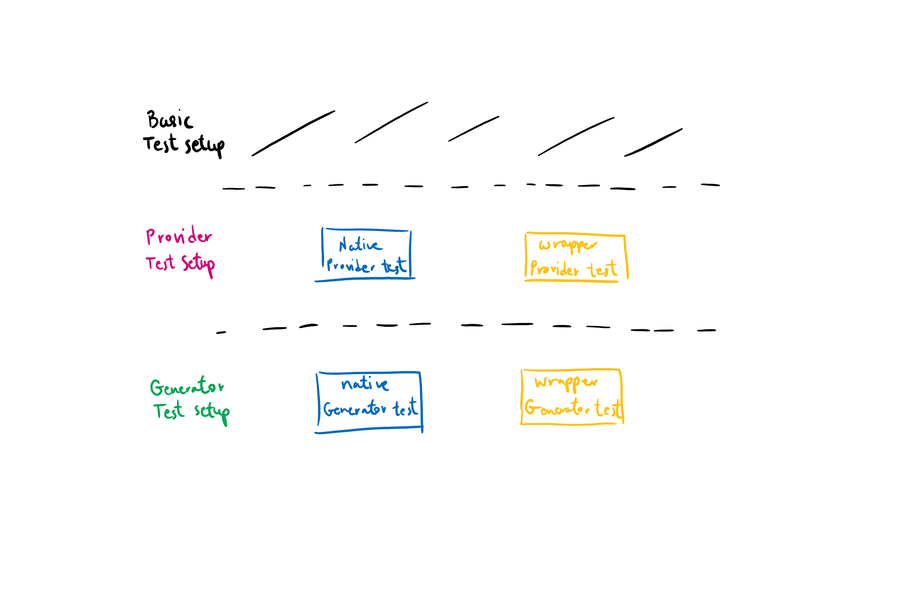

# Factory Providers Testing Suite
The library is infrastructured in such a way that separates the different parts to facilitate DI, testing, and separation of concerns. Components, wrappers and natives don't construct each other. The get injected with each other.


The injector first creates the native object and stores it, then creates a wrapper by passing it the native object and stores it, then it passes the wrapper to the component.

> For the purpose of this document, the term 'factory providers' will refer specifically to and only to providers used to create a wrapper object or a native object.

# How factory providers are created
All factory providers are created using a generator function. The generator function knows how a factory provider should operate and simplifies boostrapping, allowing the programmer to concentrate on a simple task: producing the object.

A factory provider generator receives a function that produces the actual value, and additional dependencies that function might need. It then returns an Angular `FactoryProvider` object that is ready for action.

> Generators are meant to automate things like injection of predefined dependencies and providing a platform-dependant factory solution.

# Native factories
A native factory should always:
- Produce the native object outside Angular to improve performance.
- Receive the element it was triggered for.
- Produce null on non-browser platforms.

Meaning, it should at least use the `GoogleMapsApiService`, `UniversalService`, and `ElementRef`. By default, A native factory provider generator defines these as dependencies for the factory.

# Wrapper factories
A wrapper factory should always:
- Pass the api to the produced wrapper.
- Pass the native object for wrapping to the produced wrapper.
- Produce null on non-browser platforms.

Meaning, it should at least use the `GoogleMapsApiService`, `UniversalService`, and `NativeInstance`. By default, A wrapper factory provider generator defines these as dependencies for the factory.

# How factory providers are tested
Factory providers testing is designed in layers:


Each layer is built upon the lower one to allow a scalable testing suite and simplify coding.

The testing suite for factory providers consists of:
1. Setup functions
2. Default test config functions
3. Spec production functions

These are combined to achieve an end result where the programmer can produce tests with a few lines of code:
```typescript
testOverlayNativeFactoryProvider({
    providerName      : 'NativeGoogleMapsCircleFactoryProvider',
    provider          : NativeGoogleMapsCircleFactoryProvider,
    expectedNativeType: google.maps.Circle
});

testOverlayWrapperFactoryProvider({
    providerName       : 'GoogleMapsCircleFactoryProvider',
    provider           : GoogleMapsCircleFactoryProvider,
    expectedWrapperType: GoogleMapsCircle
});
```

The setup function of every layer calls the setup function of its lower layer.

Same happens with setup config objects.

OK It's late and I need to sleep. 🥱 Maybe one day I'll improve this doc.
To understand the concept, find the `testOverlayWrapperFactoryProvider()` implementation and start clicking 'Show Definition' of called functions. That will explain the layers concept.