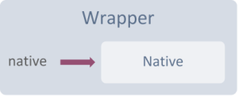
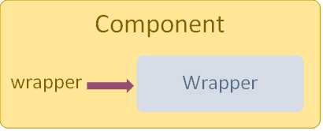
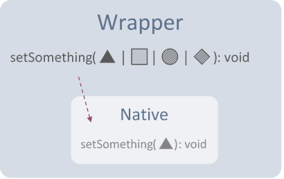
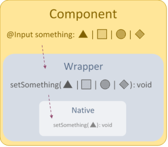

# Intro
The library wraps the native Google Maps API library, adds additional tooling around it, and provides documentation for concepts and tasks it presents. However, in some cases, it made no sense to repeat [Google Maps' documentation](https://developers.google.com/maps/documentation/javascript/tutorial), so you will be referred to the appropriate doc online.

The following concepts will help you better understand how the library operates, what to expect from it, and when to refer to Google's documentation...

[[_TOC_]]

# Natives
The library refers to types presented by Google Maps JavaScript library as 'native types'. These can be `google.maps.Map`, or `google.maps.Marker`, or any other type presented by the `google.maps` namespace.

# Wrappers
A native object is always represented by a corresponding wrapper object. However, the actual native object is always accessible through the wrapper's strongly-typed `native` property in case you need finer tuning:

<center>


</center>

> **Note** Once you put your hands on the native object, the library has no way of knowing what you'll do with it. In certain cases the library expects you to use the wrapper for its magic to work. [Overlay tracking](Overlays/Tracking.md) for example, will become useless if you add overlays directly to the native object.
>
> **Conclusions**:
> 1. Stick to wrapper objects as much as possible.
> 2. If you really have to use the native object directly, simply be aware of the above and make sure you're not causing inconsistencies.

# Components
Components and directives always rely on a wrapper object to do the work. A new instance of the corresponding wrapper is injected to each component instance. This of course means a new native object instance as well.

The wrapper is always accessible through the component's strongly-typed `wrapper` property:

<center>


</center>

# Functionality Wrapping

## Flexibility
Wrappers [use magic ✨](Internal%20Workings/Delegation-Magic.md) to delegate access to the native object's functionality, and in most cases they will simply automatically call the native functions.

To provide you with greater flexibility and ease of use, some functionalities are manually wrapped to allow support for a wider range of types, 'shortcut' some task, or do some transparent delegation preprocessing or postprocessing.

**Bottom line:**
- You will have greater powers.
- You will find that some method signatures don't exactly match the native ones.
<br/>
<br/>
<center>


</center>

## Wrapping Rules
* All getters get wrapped automatically (e.g. `GoogleMap.getCenter()`).

* All setters get wrapped automatically outside angular to optimize change detection cycles (e.g. `GoogleMap.setClickableIcons()`).

* Other functions that cause changes in the native object are also wrapped outside angular (e.g. `GoogleMap.fitBounds()`).
  
* A function which uses a callback is wrapped with a promise instead (e.g. `GoogleMapsData.toGeoJson()`).
  
* A function requiring parameters with specific types, but those types can be constructed or deduced from other types, is wrapped with a more flexible signature and converts its arguments to match the native api. (e.g. `GoogleMapMarker.setPosition()`).

# Property Delegation
Component `@Input` properties always match by name and type to their corresponding setter function on the wrapper. So `setCenter()` is delegated by `center`, `setClickableIcons()` is delegated by `clickableIcons`, and so forth...

The components in the library all use `ngOnChanged()` to delegate input changes to the wrapper.

<center>


</center>

# Event Hooking
If a native object raises events, all events supported by the object are hooked by bindable observables.
Component `@Output` properties names are always a camelCase representation of the native event name. So `bounds_changed` is hooked to `boundsChanged`, `rightclick` is hooked to `rightClick`, and so forth...

Events raised by the library always provide an events data object, even if the native event doesn't. The data object will always be a [`GoogleMapsEventData`](API/GoogleMapsEventsData.md) object (or an extending type) which, in addition to the native event data, contains other useful information like:
* The emitting wrapper
* The native object
* A simplified transformed version of the native event args.

All at hand, so you don't have to transform, produce or fetch anything yourself.

> To use the event data object, pass the `$event` object to your event handlers.

## Example
```html
<!-- Component template -->
<bs-google-map *bsSafe (mouseMove)="onMapMouseMove($event)"></bs-google-map>
```

```typescript
// Component class
import { GoogleMapsEventData } from '@bespunky/angular-google-maps/core';

@Component({...})
export YourComponent
{
    public onMapMouseMove(event: GoogleMapsEventData)
    {
        // Act on event data
    }
}
```
# [Superpowers](/The-Map/Superpowers)
The different capabilities offered by the native library, such as drawing on the map, placing overlays and others, are represented by superpowers.

These superpowers are dynamically added to the map object, depending on the modules you choose to import.
In other words:
* When you build your app, unused superpowers will be excluded from the final bundle.
* You can now lazy load superpowers.
* You can create your own superpowers and extend map capabilities!

# Next Steps
| Topic                                        | Description                                              |
|----------------------------------------------|----------------------------------------------------------|
| [The Map](/The-Map)                          | The map component and its friends.                       |
| [Programmatic Control](Programmatic-Control) | Extract wrapper objects and use them in your components. |
| [Geometry Types](/Geometry-Types)            | Flexibility for geometries.                              |
| [Injectable Services](/Injectable-Services)  | Injectable tools and providers.                          |